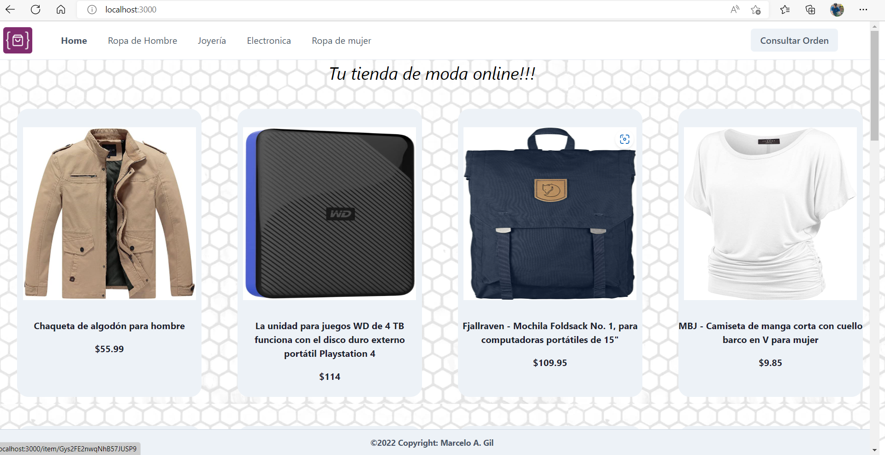
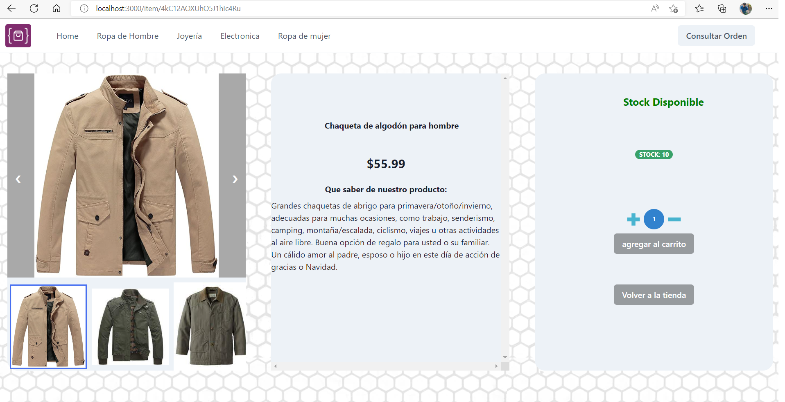
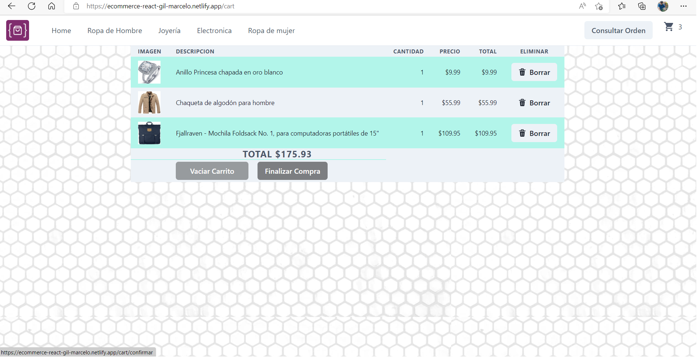
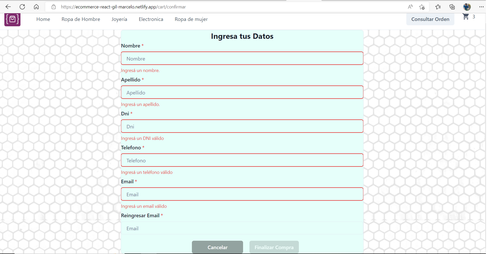
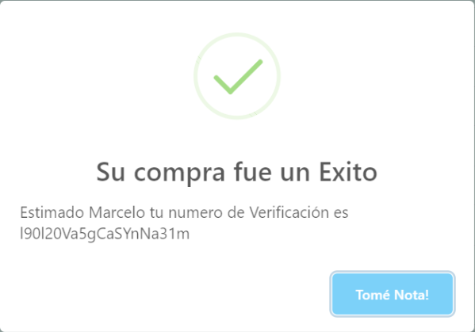
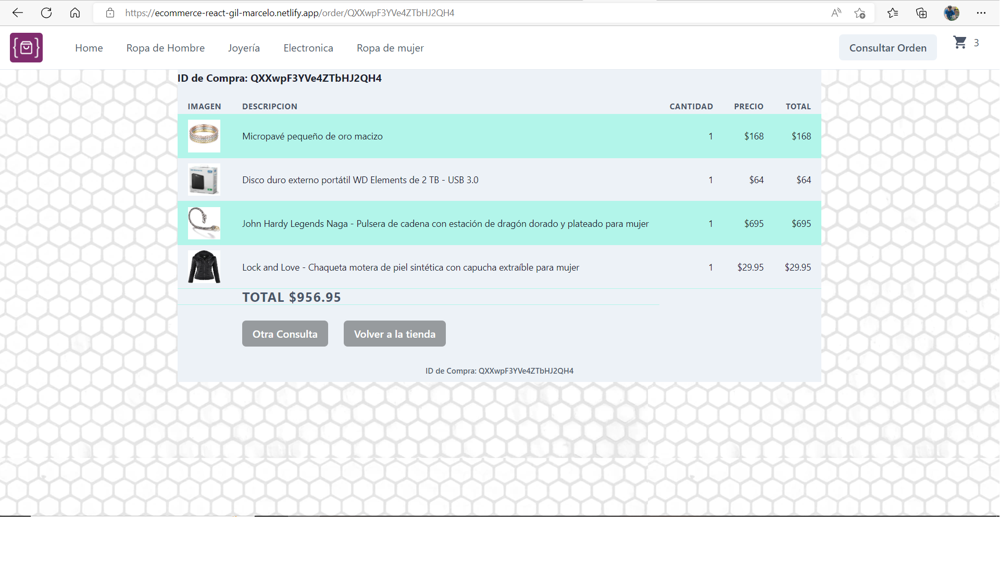

# Proyecto

Ecommerce desarrollado en React en cumplimiento al curso de "React Js de CoderHouse".

# Link de Navegación

[https://ecommerce-react-gil-marcelo.netlify.app](https://ecommerce-react-gil-marcelo.netlify.app)

# Navegación

- Home con todos los productos
- Categorías con acceso a los productos de la misma
- Carrito
- Consulta de Ordenes
- Detalle de Productos
  
  El usuario puede acceder al detalle del producto haciendo click en la foto del mismo, en donde encontrara 3 imágenes, nombre, precio, descripción, stock disponible y la posibilidad de agregar productos al carrito o volver a la tienda.
  
  El icono del carrito estará visible cuando la cantidad de ítems sea de al menos 1.
  Desde el carrito accede al resumen de la compra y para finalizar debe completar un formulario, en el momento de registrar la venta vuelve a controlar el stock.
  
  
  Guardando el id de compra luego se puede consultar desde el boton **Consultar Orden**.
  
  Consulta de Ordenes de compra
  

# Ejecucion del proyecto:

`npm run start`

El inicio local se puede ver en nuestro navegador en la dirección http://localhost:3000.
Cualquier modificación en el código, se verá reflejado aquí.

# Firebase

Esta App usa una base de datos Cloud Firestore (NoSQL) que cuenta con 3 colecciones

1. Category
   - id
   - name
   - route
2. Productos
   - category
   - description
   - images
   - price
   - initial
   - stock
   - title
3. Ventas
   - comprador
   - date
   - items
   - total

# Librerías usadas

- [Firebase:](https://firebase.google.com) explicado arriba
- [Chakra UI:](https://chakra-ui.com/) (emotion/react, emotion/styled, framer-motion) esta biblioteca se aprovecho para acelerar los tiempos de desarrollo y garantizar el diseño responsive de los componentes.
- [SweetAlert:](https://sweetalert.js.org/) para mostrar mensajes peronalizados.
- [mui/icons-material:](https://mui.com/material-ui/material-icons/) se utilizó para incorporar el icono del carrito.
- [react-carousel-minimal:](https://github.com/sahilsaha7773/react-carousel-minimal) componente para mostrar carousel de fotos no incluido en la librería Chakra

# Documentación de React

# Getting Started with Create React App

This project was bootstrapped with [Create React App](https://github.com/facebook/create-react-app).

### `npm test`

Launches the test runner in the interactive watch mode.\
See the section about [running tests](https://facebook.github.io/create-react-app/docs/running-tests) for more information.

### `npm run build`

Builds the app for production to the `build` folder.\
It correctly bundles React in production mode and optimizes the build for the best performance.

The build is minified and the filenames include the hashes.\
Your app is ready to be deployed!

See the section about [deployment](https://facebook.github.io/create-react-app/docs/deployment) for more information.

### `npm run eject`

**Note: this is a one-way operation. Once you `eject`, you can't go back!**

If you aren't satisfied with the build tool and configuration choices, you can `eject` at any time. This command will remove the single build dependency from your project.

Instead, it will copy all the configuration files and the transitive dependencies (webpack, Babel, ESLint, etc) right into your project so you have full control over them. All of the commands except `eject` will still work, but they will point to the copied scripts so you can tweak them. At this point you're on your own.

You don't have to ever use `eject`. The curated feature set is suitable for small and middle deployments, and you shouldn't feel obligated to use this feature. However we understand that this tool wouldn't be useful if you couldn't customize it when you are ready for it.

## Learn More

You can learn more in the [Create React App documentation](https://facebook.github.io/create-react-app/docs/getting-started).

To learn React, check out the [React documentation](https://reactjs.org/).

### Code Splitting

This section has moved here: [https://facebook.github.io/create-react-app/docs/code-splitting](https://facebook.github.io/create-react-app/docs/code-splitting)

### Analyzing the Bundle Size

This section has moved here: [https://facebook.github.io/create-react-app/docs/analyzing-the-bundle-size](https://facebook.github.io/create-react-app/docs/analyzing-the-bundle-size)

### Making a Progressive Web App

This section has moved here: [https://facebook.github.io/create-react-app/docs/making-a-progressive-web-app](https://facebook.github.io/create-react-app/docs/making-a-progressive-web-app)

### Advanced Configuration

This section has moved here: [https://facebook.github.io/create-react-app/docs/advanced-configuration](https://facebook.github.io/create-react-app/docs/advanced-configuration)

### Deployment

This section has moved here: [https://facebook.github.io/create-react-app/docs/deployment](https://facebook.github.io/create-react-app/docs/deployment)

### `npm run build` fails to minify

This section has moved here: [https://facebook.github.io/create-react-app/docs/troubleshooting#npm-run-build-fails-to-minify](https://facebook.github.io/create-react-app/docs/troubleshooting#npm-run-build-fails-to-minify)
